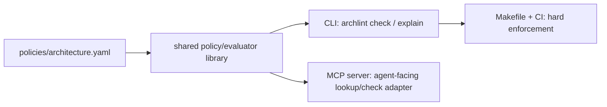

# Archlint MCP Demo

Architectural linting for coding agents: rules that agents can inspect early, and hard checks they cannot bypass at the end.

This demo is built around one invariant:

> MCP is an adapter. `policies/architecture.yaml` and the shared evaluator are the source of truth.



The MCP server helps a coding agent discover architectural rules before it writes code. The CLI, Makefile, and CI path defend the repository after code is written. This is the core Architectural Linting pattern.

## Quickstart

```bash
npm install
make presubmit
```

The default check targets `demo-repo/`, a passing fake bank/payments repository.

To see intentional failures:

```bash
npm run archlint -- check --repo fixtures/failing
```

To inspect rules for a file:

```bash
npm run archlint -- explain demo-repo/packages/web/src/accountPage.ts --repo demo-repo
```

To run the MCP stdio server:

```bash
npm run mcp
```

## Documentation

- [Documentation index](docs/index.md)
- [System architecture](docs/architecture.md)
- [Demo walkthrough](docs/demo-walkthrough.md)
- [Agent MCP workflow](docs/agent-mcp-workflow.md)
- [Hard enforcement path](docs/enforcement.md)
- [Policy authoring](docs/policy-authoring.md)
- [Follow-up article draft](docs/article-draft.md)

## Project Shape

- `policies/architecture.yaml`: architecture rules and metadata.
- `src/policy.ts`: policy loading, validation, and applicable-rule lookup.
- `src/analyzer.ts`: TypeScript import fact extraction.
- `src/verifier.ts`: pure policy evaluation.
- `src/cli.ts`: developer-facing CLI.
- `src/mcp.ts`: MCP adapter over the shared service.
- `demo-repo/`: passing synthetic bank/payments repository.
- `fixtures/failing/`: intentional violations for demos and tests.

## Core Commands

```bash
npm run archlint -- check
npm run archlint -- check --json
npm run archlint -- check --repo fixtures/failing
npm run archlint -- explain demo-repo/packages/web/src/accountPage.ts --repo demo-repo
npm run archlint -- list-rules
```

`check` exits `0` when there are no error-level violations and non-zero when error-level violations exist.

## Harness Model

A coding-agent harness should require `make presubmit` before accepting work as complete. MCP gives the agent earlier visibility into the rules, but the verifier is the non-optional enforcement point.

## License

MIT. See [LICENSE](LICENSE).
