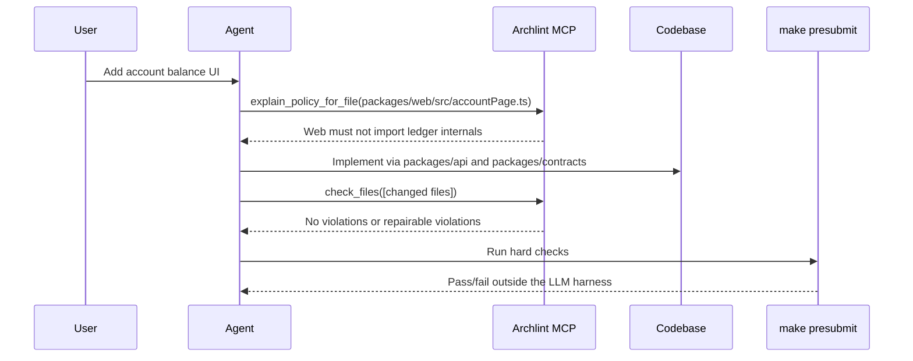

# Agent MCP Workflow

MCP is useful because it lets an agent inspect architectural policy at the moment it is deciding how to implement a change. That is earlier than presubmit and more structured than a prose instruction file.

MCP is not sufficient because an agent can still make a mistake. The hard check remains `make presubmit`.



## Available Tools

The MCP server exposes three narrow tools:

- `list_architecture_rules`
- `explain_policy_for_file`
- `check_files`

Each tool calls the shared service used by the CLI. The MCP server does not contain independent architecture rules.

## Scenario: Agent Plans a Web Change

User request:

```text
Add a payment summary to the account page.
```

Good agent behavior:

```text
I am touching browser-facing code, so I will ask the architecture policy what boundaries apply before choosing imports.
```

MCP call:

```json
{
  "tool": "explain_policy_for_file",
  "arguments": {
    "filePath": "packages/web/src/accountPage.ts"
  }
}
```

Representative response:

```json
{
  "file": "packages/web/src/accountPage.ts",
  "applicableRules": [
    {
      "id": "web-cannot-import-ledger",
      "from": "packages/web/**",
      "disallowImports": ["packages/ledger/**"],
      "reason": "Browser-facing code must not depend on ledger internals.",
      "suggestedFixes": [
        "Call packages/api instead.",
        "Use packages/contracts for shared types."
      ],
      "severity": "error",
      "requiredChecks": ["npm test", "npm run archlint:check"],
      "escalation": {
        "required": true,
        "reviewGroups": ["platform", "security"],
        "reason": "Ledger access from browser-facing code requires explicit architectural review."
      }
    }
  ]
}
```

The agent now has concrete implementation guidance:

- Do not import `packages/ledger/**` from `packages/web/**`.
- Use `packages/api` for behavior.
- Use `packages/contracts` for shared types.
- Expect `npm test` and `npm run archlint:check` to be relevant checks.

## Scenario: Agent Catches a Bad Import Early

Suppose the agent generated this import in web code:

```ts
import { postTransaction } from "../../../ledger/src/postTransaction";
```

Before declaring the task done, the agent can ask MCP to check the changed file:

```json
{
  "tool": "check_files",
  "arguments": {
    "repo": "fixtures/failing",
    "files": ["packages/web/src/accountPage.bad.ts"]
  }
}
```

Representative response:

```json
{
  "ok": false,
  "violations": [
    {
      "ruleId": "web-cannot-import-ledger",
      "severity": "error",
      "fromFile": "packages/web/src/accountPage.bad.ts",
      "importedPath": "packages/ledger/src/postTransaction.ts",
      "reason": "Browser-facing code must not depend on ledger internals.",
      "suggestedFixes": [
        "Call packages/api instead.",
        "Use packages/contracts for shared types."
      ]
    }
  ]
}
```

The correct agent response is to change the implementation, not to argue with the policy. For example, the agent should route payment behavior through `packages/api` and keep shared data shapes in `packages/contracts`.

## Scenario: Agent Lists Policy Before a Larger Change

For a broader feature touching multiple packages:

```json
{
  "tool": "list_architecture_rules",
  "arguments": {}
}
```

The agent can use the returned rules to build an implementation plan:

- Web can depend on API and contracts, not ledger internals.
- API must not import browser/UI code.
- Contracts must not import runtime packages.

This is the practical value of MCP: the agent can query structured project policy instead of relying on a compressed memory of prose instructions.

## What MCP Does Not Do

MCP does not approve changes. It does not replace CI. It does not make architectural decisions. It exposes facts and checks from the shared policy engine.

An agent might ignore the MCP tool, skip the query, or make a bad edit after receiving correct guidance. That is why the same evaluator must run in the hard enforcement path.
