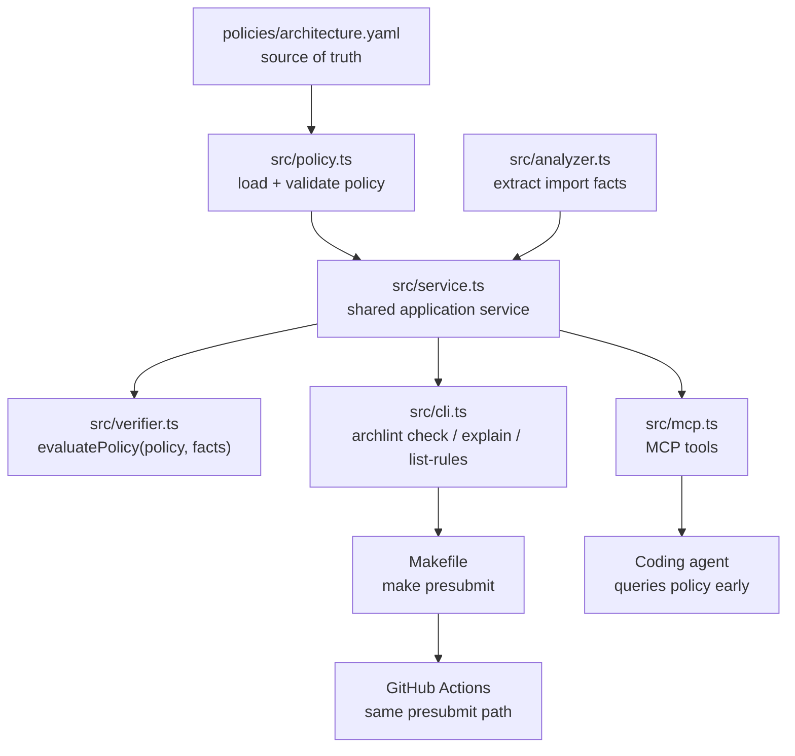
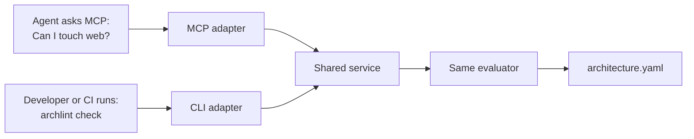

# System Architecture

Archlint MCP Demo has one policy source of truth and several surfaces over it. The important design choice is that MCP is not special. It is another adapter over the same loader, analyzer, and evaluator used by the CLI verifier.



## Component Responsibilities

| Component | Responsibility |
|---|---|
| `policies/architecture.yaml` | Declares architectural rules and repair guidance. |
| `src/policy.ts` | Loads, validates, and returns typed policy objects. |
| `src/analyzer.ts` | Reads TypeScript files and extracts import facts. |
| `src/verifier.ts` | Pure evaluator that converts policy plus facts into violations. |
| `src/service.ts` | Shared service used by CLI and MCP. |
| `src/cli.ts` | Developer-facing commands and exit codes. |
| `src/mcp.ts` | Agent-facing stdio MCP adapter. |
| `Makefile` and CI | Non-optional enforcement path. |

## The Critical Boundary

The MCP server must not contain architectural policy interpretation that the CLI verifier does not use. If a rule is meaningful enough to tell an agent, it must be meaningful enough to check in `make presubmit`.



The difference between the two paths is timing and audience:

- MCP is early visibility for agents.
- CLI/Make/CI is hard enforcement for the repository.

## Evaluator Contract

The core evaluator operates on facts, not raw files:

```ts
type ImportFact = {
  fromFile: string;
  importedPath: string;
  rawImport: string;
};

type Violation = {
  ruleId: string;
  severity: "error" | "warning";
  fromFile: string;
  importedPath: string;
  reason: string;
  suggestedFixes: string[];
};
```

The pure function is:

```ts
evaluatePolicy(policy, facts): Violation[]
```

That separation matters. The analyzer can evolve later, but the policy decision remains testable without filesystem access.

## Current v1 Scope

The implementation intentionally supports a narrow slice:

- TypeScript source files.
- Relative imports resolved to repo-relative paths.
- Glob-based `from` and `disallowImports` rules.
- Error and warning severities.
- Required checks and escalation metadata displayed/preserved as policy context.

The v1 does not support package aliases, symbol-level rules, semantic analysis, GitHub auth, PR diff mode, or risk scoring. Those may be useful later, but they are not needed to prove the Architectural Linting pattern.
