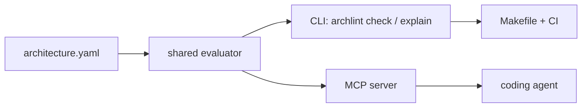

# Architectural Linting for Coding Agents: From Guidance to Guardrails

This draft is a follow-up to [The Case for Architectural Linting](https://rogerfleig.substack.com/p/the-case-for-architectural-linting), moving from the argument for hard architectural rules to a concrete MCP plus verifier demonstration.

Coding agents are getting good enough that the bottleneck is no longer just whether they can write code. The harder question is whether they can write code that respects the shape of a real system.

Every mature codebase has boundaries that matter. Browser-facing code should not reach into ledger internals. Shared contract packages should not import runtime services. API layers should not depend on UI code. These rules are often obvious to senior engineers and nearly invisible to everyone else, including an agent dropped into the repository with a broad implementation task.

The common answer is to write better instructions. Put rules in `AGENTS.md`. Add architecture notes to the README. Tell the agent to preserve boundaries. This is necessary, but it is not enough.

Guidance is not enforcement.

## The Problem With Prompt-Only Architecture

Prompt obedience is a weak foundation for architectural governance.

A coding agent can read a rule and still violate it. It can miss the relevant part of the instructions. It can compress away the detail during a long session. It can optimize for the immediate task and choose an import that looks convenient. It can preserve an existing violation while editing nearby code. It can pass unit tests while still damaging the architecture.

This is not a moral failure by the model. It is an engineering boundary. If a rule matters to the codebase, the rule should not depend on the model remembering it.

The answer is to treat architecture rules the way we treat tests, formatting, type checks, and lint rules: make them executable.

That is the core idea behind Architectural Linting.

## What Architectural Linting Means

Architectural Linting means encoding structural rules about a codebase as deterministic policy, then running that policy through normal developer and CI workflows.

The policy should be readable by humans. It should be inspectable by agents. But the final compliance decision should be made by code.

In the demo repository, the source of truth is a YAML file:

```yaml
rules:
  - id: web-cannot-import-ledger
    from: "packages/web/**"
    disallowImports:
      - "packages/ledger/**"
    reason: "Browser-facing code must not depend on ledger internals."
    suggestedFixes:
      - "Call packages/api instead."
      - "Use packages/contracts for shared types."
    severity: error
```

That rule is intentionally simple. It says that browser-facing code cannot import ledger internals. The reason and suggested fixes are there for humans and agents. The path globs are there for deterministic evaluation.

The important part is not YAML. The important part is that the policy can be evaluated without asking a model what it thinks.

## MCP Is an Adapter, Not the Authority

MCP is useful in this pattern because it gives coding agents structured access to project policy.

An agent working on `packages/web/src/accountPage.ts` can ask:

```json
{
  "tool": "explain_policy_for_file",
  "arguments": {
    "filePath": "packages/web/src/accountPage.ts"
  }
}
```

The response can tell it:

- web code must not import ledger internals
- shared types should come from contracts
- payment behavior should be routed through the API
- relevant checks include `npm test` and `npm run archlint:check`

That is valuable. It gets the constraint into the agent's decision loop before the code is generated.

But MCP should not be the enforcement boundary. An agent can ignore MCP. A harness can fail to call the tool. A model can call the tool, receive the right answer, and still make the wrong change.

So the rule is:

```text
MCP is an adapter. The policy engine is the source of truth.
```

The MCP server should expose facts and checks. It should not contain architectural logic that is absent from the CLI verifier.

## The Shape of the System

The demo uses this flow:



There are two feedback loops.

The first loop is preventive. The agent asks MCP what rules apply before or during code generation. This helps it choose a compliant implementation.

The second loop is defensive. The repository runs `make presubmit`. If the generated code violates an error-level architecture rule, the verifier exits non-zero. That failure happens outside the model's control.

Both loops use the same evaluator.

## A Concrete Example

Suppose an agent is asked to add a payment summary to the account page. The convenient implementation might be to import the ledger function directly:

```ts
import { postTransaction } from "../../../ledger/src/postTransaction";
```

In a prompt-only system, you are relying on the agent to remember that this is not allowed.

In an Architectural Linting system, the agent can query policy first:

```json
{
  "tool": "explain_policy_for_file",
  "arguments": {
    "filePath": "packages/web/src/accountPage.ts"
  }
}
```

It learns that `packages/web/**` must not import `packages/ledger/**`, and that it should call `packages/api` or use `packages/contracts` instead.

If the agent still writes the bad import, the hard check catches it:

```text
FAIL web-cannot-import-ledger

packages/web/src/accountPage.bad.ts
  imports packages/ledger/src/postTransaction.ts

Browser-facing code must not depend on ledger internals.

Suggested fixes:
  - Call packages/api instead.
  - Use packages/contracts for shared types.
```

That failure is not a suggestion. It is a non-zero exit code.

## Why the CLI Matters

The CLI is the developer-facing enforcement surface:

```bash
npm run archlint -- check
```

The Makefile turns it into a local completion gate:

```bash
make presubmit
```

CI runs the same path:

```text
npm ci
make presubmit
```

This matters because the agent is no longer the final judge. The model can propose code. The repository decides whether the code satisfies the architecture.

That is the shift: from "please follow these rules" to "these rules are part of the build."

## What To Encode First

The best first rules are boring and structural:

- UI code cannot import persistence internals.
- Shared contracts cannot import runtime services.
- Server packages cannot import browser packages.
- Sensitive packages require explicit review metadata.
- Generated code cannot cross package boundaries directly.

Do not start with a general architecture advisor. Do not ask a model to infer intent from the codebase. Do not build a risk scoring product before you can block one bad import.

Start with rules that senior engineers already enforce in review and encode them as executable checks.

## What Not To Build Too Early

The demo intentionally avoids a lot of tempting features:

- GitHub authentication
- PR review automation
- CODEOWNERS integration
- dependency graph visualization
- symbol-level analysis
- risk scoring
- language-server integration
- web UI

Those features may become useful later. They are not required to prove the core pattern.

The first milestone is smaller and more important: one source of truth, one evaluator, multiple adapters, deterministic enforcement.

## The Engineering Principle

Coding agents make architectural linting more important, not less.

When humans were the primary authors of code, architecture rules could survive partly as shared memory, code review culture, and senior engineer taste. That was never perfect, but it was often enough.

Agents change the scale and texture of code generation. They can produce plausible code quickly, and plausible code can still violate important boundaries. The more code we ask agents to write, the more we need executable constraints around the parts of the system that matter.

The right pattern is not to hide the rules from the agent. The right pattern is to expose the rules early and enforce them later.

MCP gives agents visibility. Architectural linting gives the repository a spine.

## The Demo In One Sentence

This repository demonstrates a small but production-shaped pattern for agentic software development: policies are readable by agents through MCP, but enforced by deterministic checks through CLI, Make, and CI.
