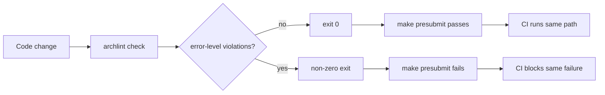

# Hard Enforcement Path

Architectural Linting is not just documentation. The repository must have a deterministic check that can fail work without asking the model for permission.

In this project, the hard path is:



## Local Enforcement

The Makefile is the local completion gate:

```bash
make presubmit
```

It runs:

```make
presubmit:
	npm test
	npm run archlint:check
```

The architectural verifier is part of the same presubmit path as the normal test suite.

## CLI Exit Behavior

`archlint check` returns:

- `0` when there are no error-level violations.
- non-zero when one or more error-level violations exist.

That exit code is what makes the rule enforceable by Make and CI.

## CI Enforcement

The GitHub Actions workflow runs the same path used locally:

```text
npm ci
make presubmit
```

There is no separate cloud-only policy engine and no agent-only approval step. Local and CI enforcement use the same verifier.

## Why This Matters for Agents

Instruction files and MCP tools improve the odds that an agent writes compliant code. They do not prove compliance.

An agent can fail in ordinary ways:

- It may not read all instructions.
- It may read the policy but choose a convenient import.
- It may preserve a violation while editing nearby code.
- It may optimize for passing tests that do not encode architecture.
- It may summarize away a constraint during a long session.

The hard check addresses those failure modes by moving the final decision out of the model.

## Concrete Failure

The failing fixture shows three architectural violations:

```bash
npm run archlint -- check --repo fixtures/failing
```

```text
FAIL api-cannot-import-web

packages/api/src/serverImportsWeb.bad.ts
  imports packages/web/src/accountPage.ts

Server API must not depend on browser/UI code.

Suggested fixes:
  - Move shared logic into packages/contracts.
  - Expose behavior through an API boundary.

FAIL contracts-cannot-import-runtime

packages/contracts/src/runtimeImport.bad.ts
  imports packages/auth/src/session.ts

Contracts must remain pure shared schema/types.

Suggested fixes:
  - Move runtime behavior out of contracts.
  - Keep contracts limited to types and schemas.

FAIL web-cannot-import-ledger

packages/web/src/accountPage.bad.ts
  imports packages/ledger/src/postTransaction.ts

Browser-facing code must not depend on ledger internals.

Suggested fixes:
  - Call packages/api instead.
  - Use packages/contracts for shared types.
```

The output is concise on purpose. It tells the developer or agent:

- which rule failed
- where the violation is
- what import caused it
- why the rule exists
- how to repair the change

## Guidance vs Enforcement

| Surface | Purpose | Can block completion? |
|---|---|---|
| `AGENTS.md` | Human and agent guidance | No |
| README/docs | Explanation and onboarding | No |
| MCP tools | Agent-facing policy lookup | No |
| `archlint check` | Deterministic verification | Yes |
| `make presubmit` | Local completion gate | Yes |
| CI | Shared repository gate | Yes |

Good agent governance uses both categories. Guidance steers code generation early. Enforcement decides whether the result is acceptable.
