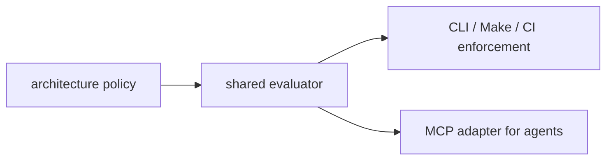

# Documentation Index

This repository demonstrates Architectural Linting: machine-readable architecture rules exposed to coding agents through MCP and enforced through deterministic checks outside the model's control.

It is designed as a concrete follow-up to Roger Fleig's Substack essay, [The Case for Architectural Linting](https://rogerfleig.substack.com/p/the-case-for-architectural-linting).

The implementation is intentionally small. It is not a general static analyzer, a pull-request bot, or an architecture inference system. It shows a production-shaped pattern in miniature:

## Reading Order

1. [System architecture](architecture.md) explains the components and why MCP is not the source of truth.
2. [Demo walkthrough](demo-walkthrough.md) shows the fake bank/payments repository, passing checks, and intentional failures.
3. [Agent MCP workflow](agent-mcp-workflow.md) shows how a coding agent should query policy before and after code generation.
4. [Hard enforcement path](enforcement.md) explains how the same logic defends the codebase through CLI, Make, and CI.
5. [Policy authoring](policy-authoring.md) documents the current policy schema and how to add rules safely.
6. [Follow-up article draft](article-draft.md) is a publication-oriented narrative derived from the demo.

## The Thesis

Instructions in `AGENTS.md`, `README.md`, and prompts are useful context. They are not enforcement. A coding agent can miss them, compress them away, misread them, or choose a locally convenient implementation that violates a system boundary.

Architectural Linting turns the most important structural rules into executable policy. The policy is still readable by humans and agents, but compliance is decided by deterministic code.

In this demo:

- `policies/architecture.yaml` is the source of truth.
- `evaluatePolicy(policy, facts)` is the shared decision point.
- `archlint check` gives developers a local verifier.
- `make presubmit` is the hard completion gate.
- The MCP server exposes the same facts and checks to agents.

## What This Demo Proves

- Agents can inspect architectural rules before they edit files.
- The same rules can be checked after edits without relying on the agent's judgment.
- MCP is valuable as a visibility layer without becoming the enforcement boundary.
- A small policy engine can be understandable in minutes and still demonstrate the right separation of concerns.

## What This Demo Avoids

- No GitHub authentication.
- No company data.
- No symbol-level analysis.
- No package alias support in v1.
- No risk scoring.
- No PR bot.
- No MCP-only policy logic.

Those choices keep the system focused on the main claim: architectural rules should be visible to agents, but enforced outside the model.
